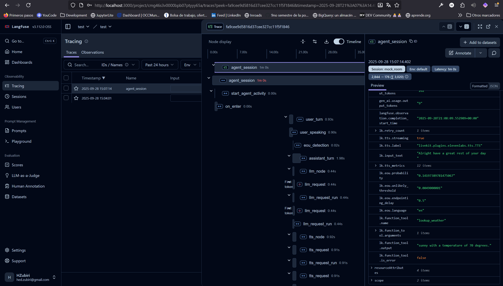

# Tracing and metrics

## Langfuse

Langfuse is an open-source LLM engineering platform that helps teams collaboratively debug, analyze, and iterate on their LLM applications. All platform features are natively integrated to accelerate the development workflow. Langfuse is open, self-hostable, and extensible. 

Observability is essential for understanding and debugging LLM applications. Unlike traditional software, LLM applications involve complex, non-deterministic interactions that can be challenging to monitor and debug. Langfuse provides comprehensive tracing capabilities that help you understand exactly what’s happening in your application.

- Traces include all LLM and non-LLM calls, including retrieval, embedding, API calls, and more
- Support for tracking multi-turn conversations as sessions and user tracking
- Agents can be represented as graphs
- Capture traces via our native SDKs for Python/JS, 50+ library/framework integrations, OpenTelemetry, or via an LLM Gateway such as LiteLLM

### SETUP

docker engine its required.

Set a command prompt into the langfuse folder with de `docker-compose.yaml` then `docker compose up -d`

Then you can access to the web ui `http://localhost:3000`

- Create an account 
- Create a project
- Get API KEYS to use with the agent
